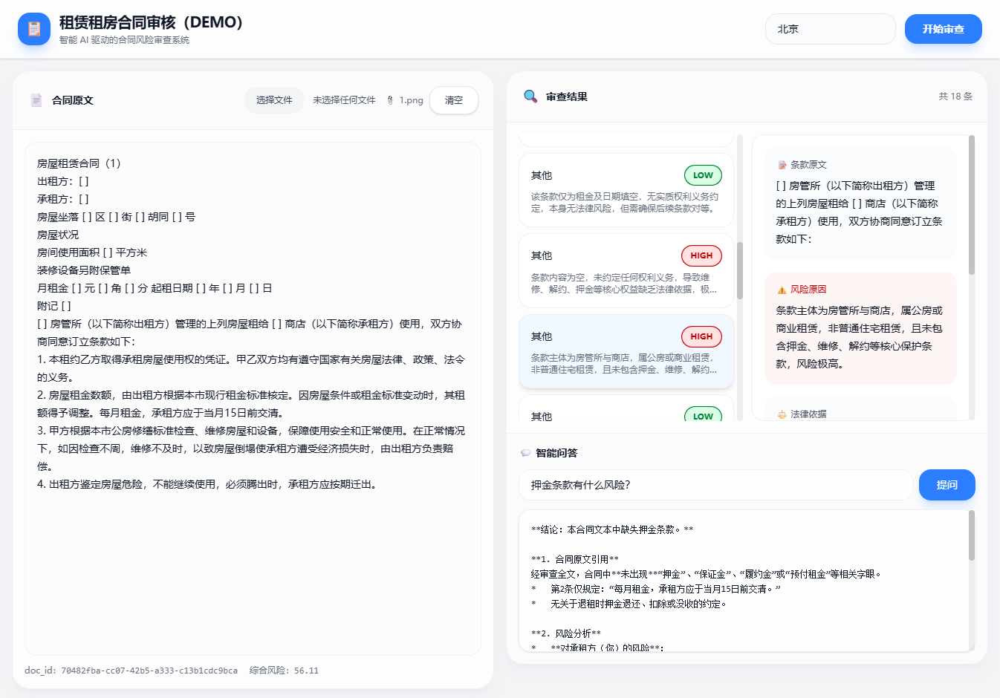

# 租赁租房合同审核 Agent

[](https://opensource.org/licenses/MIT)

面向普通租客的 Web 应用：上传租房合同后，系统自动 OCR 提取文本、按条款维度进行法律风险审查，输出结构化结论、风险评分与修改建议，并支持基于合同内容的问答。



## 功能特点

- 📄 **智能 OCR**：自动提取合同文本
- 🔍 **条款审查**：按条款维度进行法律风险审查
- 📊 **风险评分**：输出结构化结论与风险评分
- 💡 **修改建议**：提供可执行的修改建议与谈判话术
- 💬 **智能问答**：基于合同内容的流式问答

## 技术栈

- **后端**：FastAPI + Python（调用本地 vLLM OpenAI 兼容接口）
- **前端**：Vue3 + Vite + Tailwind
- **模型服务**：vLLM（`/v1/chat/completions`）

## 许可证

本项目采用 MIT 许可证 - 详见 [LICENSE](LICENSE) 文件

## 贡献

欢迎贡献！请查看 [CONTRIBUTING.md](CONTRIBUTING.md) 了解如何参与项目开发。

## 安全

如发现安全漏洞，请查看 [SECURITY.md](SECURITY.md) 了解如何报告。

## 项目结构

```
Project/
├── backend/              FastAPI 后端
│   ├── app/
│   │   ├── main.py       入口
│   │   ├── config.py     环境变量
│   │   ├── schemas.py    Pydantic 模型
│   │   ├── services/
│   │   │   ├── ocr.py    OCR / 文本抽取
│   │   │   ├── review.py 条款切分 + 审查
│   │   │   └── qa.py     问答（SSE 流式）
│   │   └── utils/
│   │       └── openai_client.py  OpenAI 兼容客户端
│   ├── venv/             Python 虚拟环境（不提交）
│   └── .env              配置（API 地址、模型名等）
└── frontend/             Vue3 前端（待初始化）
```

## 快速启动

### 后端

```powershell
cd backend
.\venv\Scripts\activate
uvicorn app.main:app --reload --host 0.0.0.0 --port 8000
```

### 前端

```powershell
cd frontend
npm install
npm run dev
```
